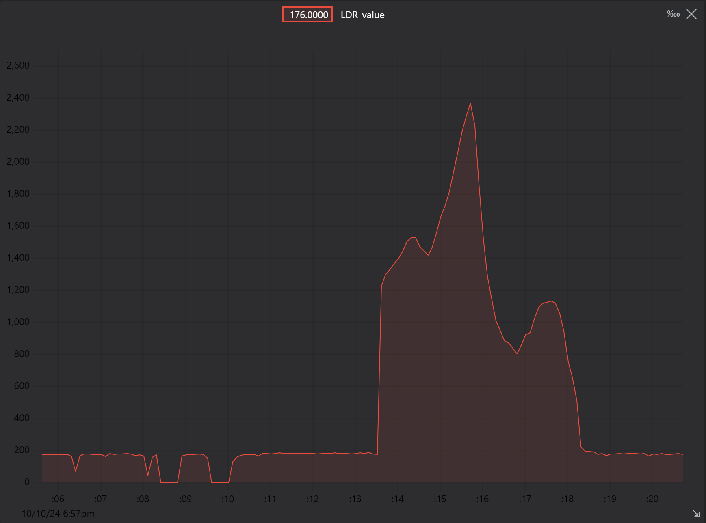

# LDR Light Intensity Monitoring with ESP32

This project reads the light intensity using a Light Dependent Resistor (LDR) connected to the ESP32 and visualizes it in real-time using Teleplot. The light intensity is measured in analog values (ranging from 0 to 4095) using the ADC of the ESP32, and the data is transmitted over UART. The project uses the Teleplot extension in Visual Studio Code to graph the real-time light intensity values.

## Project Overview
- **Microcontroller**: ESP32
- **Sensor**: Light Dependent Resistor (LDR) connected to the ADC pin.
- **ADC Resolution**: 12-bit (0 - 4095)
- **Real-time Visualization**: Teleplot extension in VSCode

## Features
- Reads the light intensity from the LDR sensor.
- Prints the light intensity values over UART in the range from 0 to 4095.
- Displays real-time graph of the light intensity using Teleplot.

## Requirements
- **ESP32**
- **LDR Sensor**
- **Teleplot extension** in Visual Studio Code

## How It Works
The LDR sensor is connected to the ADC pin of the ESP32. The analog value of the LDR is read using `analogRead()`, and the value is printed to the UART in a specific format that Teleplot reads and visualizes as a graph. Teleplot graphs the light intensity in real-time, helping monitor changes in the environment's brightness.

## Real-time Light Intensity Graph

Below is an example of the real-time graph generated by Teleplot during the experiment:

This graph shows the changes in light intensity captured by the LDR sensor over time.

## Usage Instructions
1. Connect the LDR to the ESP32's ADC pin (in this case, pin 39).
2. Upload the code to the ESP32 using PlatformIO in VSCode.
3. Install the **Teleplot** extension for VSCode.
4. Run the project and open the **Teleplot** extension. Select the correct COM port and baud rate (115200).
5. Observe the real-time light intensity graph.
